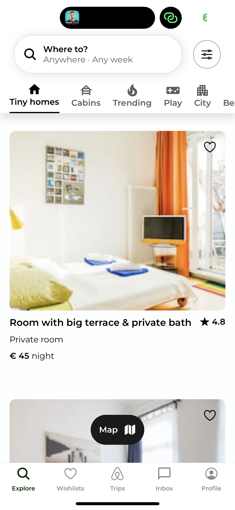
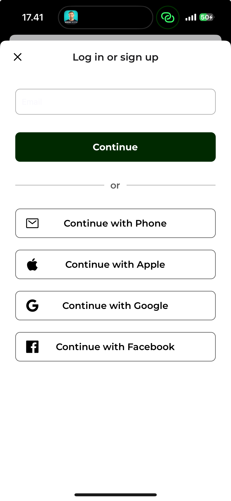
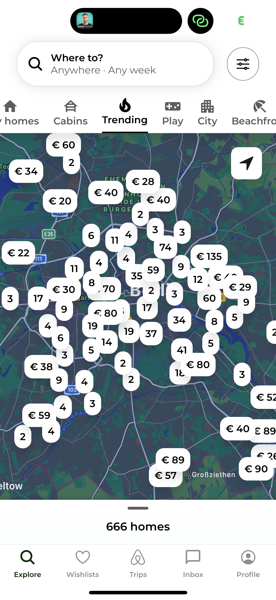
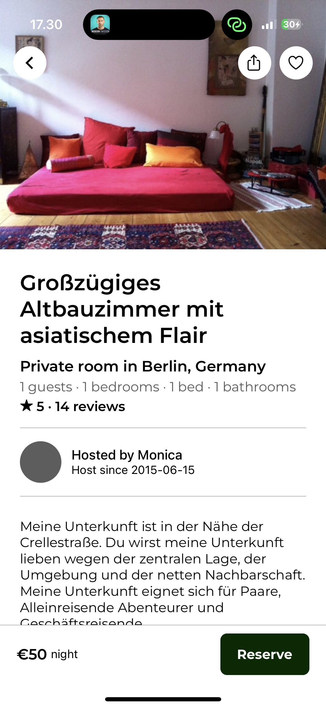
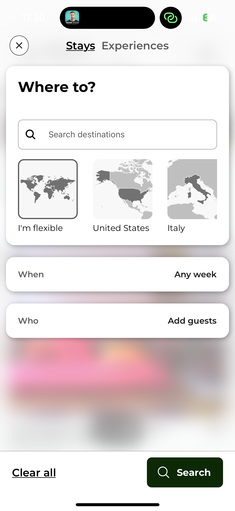
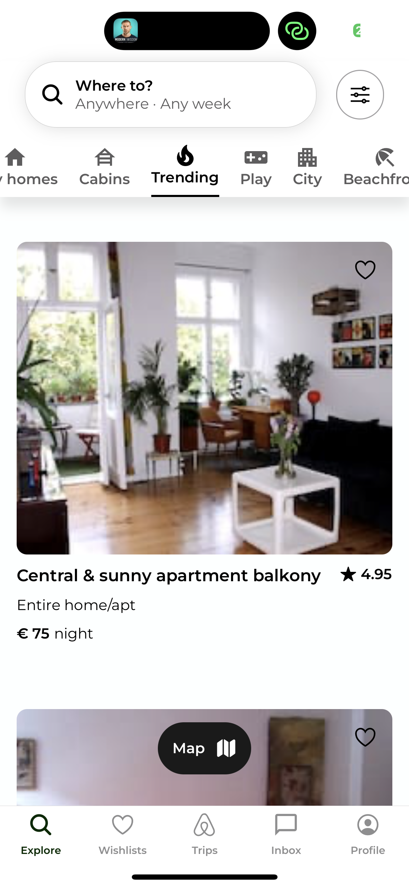

# React Native HotelManagement using Clerk Authentication and dummy data from Kaggle

This is a React Native AirBnB clone using [Clerk](https://clerk.com/?utm_source=sponsorship&utm_medium=github&utm_campaign=simong&utm_content=rn-airbnb) for user authentication.

Additional features:

- [Expo Router](https://docs.expo.dev/routing/introduction/) file-based navigation
- [Google](https://clerk.com/docs/authentication/social-connections/google?utm_source=sponsorship&utm_medium=github&utm_campaign=simong&utm_content=rn-airbnb) & [Apple](https://clerk.com/docs/authentication/social-connections/apple?utm_source=sponsorship&utm_medium=github&utm_campaign=simong&utm_content=rn-airbnb) Auth with Clerk
- [Reanimated](https://reanimated-beta-docs.swmansion.com/) 3 for animations
- [MapView](https://docs.expo.dev/versions/latest/sdk/map-view/) with Marker and [Clustering](https://github.com/venits/react-native-map-clustering)
- [Bottom Sheet](https://gorhom.github.io/react-native-bottom-sheet/)
- Modal with Animations and Blurred Background

## Screenshots

## Demo

//dummy client key for CLERK
EXPO_PUBLIC_CLERK_PUBLISHABLE_KEY=pk_test_Y29vbC1yYXR0bGVyLTEuY2xlcmsuYWNjb3VudHMuZGV2JA
